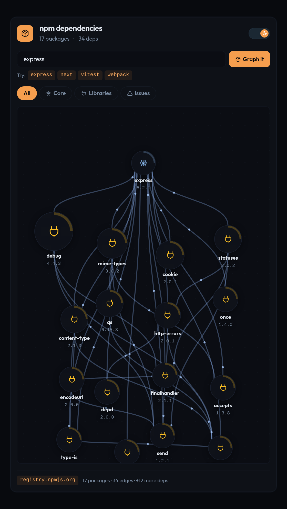
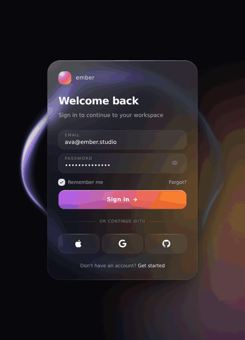
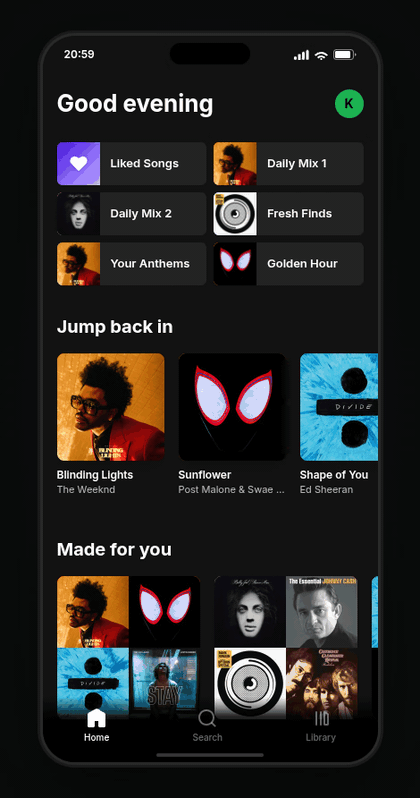
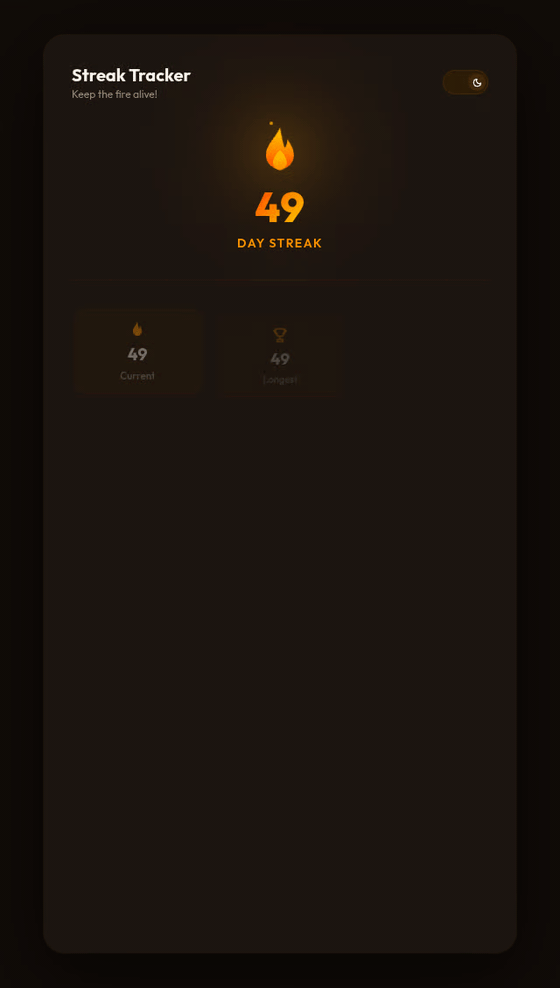
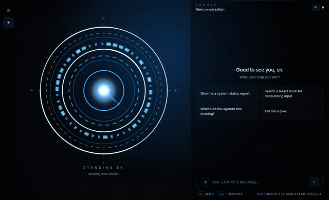

# UI components

[](https://github.com/karelmraz/ui-components/actions/workflows/ci.yml)
[](https://karelmraz.github.io/ui-components/)

React + TypeScript interfaces I build for my social media content — free on [Atheros Learning](https://learning.atheros.ai/ui-components?stack=react), with build breakdowns on [Instagram](https://www.instagram.com/karelm_dev/) and [LinkedIn](https://www.linkedin.com/in/karel-mr%C3%A1z-6017a8184/).

Live demos: **https://karelmraz.github.io/ui-components/**

## Projects

<table>
  <tr>
    <td width="50%" valign="top">
      <a href="./dependency-graph"></a>
      <h3><a href="./dependency-graph">Dependency graph</a></h3>
      <p>Search any npm package and explore its live dependency graph — real registry, download and vulnerability data.</p>
      <p><code>React 19</code> <code>TanStack Query</code> <code>Vitest</code> · <a href="https://karelmraz.github.io/ui-components/dependency-graph/">demo</a></p>
    </td>
    <td width="50%" valign="top">
      <a href="./liquid-glass-login"></a>
      <h3><a href="./liquid-glass-login">Liquid glass login</a></h3>
      <p>Frosted glass login over a WebGL orb; the highlight follows your pointer with zero re-renders.</p>
      <p><code>React 18</code> <code>WebGL</code> <code>framer-motion</code> · <a href="https://karelmraz.github.io/ui-components/liquid-glass-login/">demo</a></p>
    </td>
  </tr>
  <tr>
    <td width="50%" valign="top">
      <a href="./spotify-clone"></a>
      <h3><a href="./spotify-clone">Spotify clone</a></h3>
      <p>Mobile music player with a drag-able 3D album carousel and a fake playback engine — UI only, no real music plays.</p>
      <p><code>React 19</code> <code>framer-motion</code> <code>Vitest</code> · <a href="https://karelmraz.github.io/ui-components/spotify-clone/">demo</a></p>
    </td>
    <td width="50%" valign="top">
      <a href="./streak-visualizer"></a>
      <h3><a href="./streak-visualizer">Streak visualizer</a></h3>
      <p>Habit dashboard — contribution heatmap, live streak recompute, milestone celebrations.</p>
      <p><code>React 19</code> <code>framer-motion</code> <code>Vitest</code> · <a href="https://karelmraz.github.io/ui-components/streak-visualizer/">demo</a></p>
    </td>
  </tr>
  <tr>
    <td width="50%" valign="top">
      <a href="./interactive-globe"></a>
      <h3><a href="./interactive-globe">Interactive globe</a></h3>
      <p>Dotted 3D globe hero — drag to spin, zoom, hover hubs, fire request arcs.</p>
      <p><code>React 18</code> <code>three.js</code> · <a href="https://karelmraz.github.io/ui-components/interactive-globe/">demo</a></p>
    </td>
    <td width="50%" valign="top">
      <a href="./ai-chat-orb"></a>
      <h3><a href="./ai-chat-orb">AI chat orb</a></h3>
      <p>AI chat interface around a hand-written GLSL orb that reacts to app state.</p>
      <p><code>React 18</code> <code>WebGL / GLSL</code> · <a href="https://karelmraz.github.io/ui-components/ai-chat-orb/">demo</a></p>
    </td>
  </tr>
</table>

## Running

Node 20.19+ (or 22).

```bash
cd dependency-graph   # or any other folder
npm install
npm run dev
```

Every project also has `npm run build`, `lint`, `format` and `audit` (Lighthouse); the ones with tests use `npm run test`.

## License

MIT — see [LICENSE](./LICENSE).
