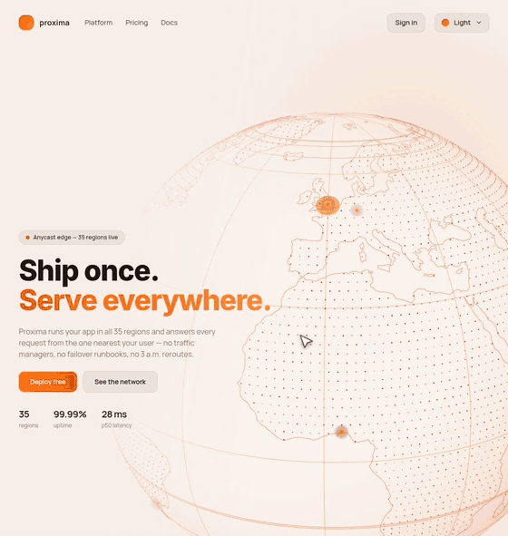

# Interactive globe

A landing-page hero for a fictional edge platform, built around an interactive dotted 3D globe: drag to spin, scroll to zoom, hover a hub for its latency, click to fire a burst of request arcs.



[Live demo](https://karelmraz.github.io/ui-components/interactive-globe/)

## What it does

- A dotted globe with coastline outlines, a graticule, a lit sphere, twinkling land dots and 12 hub markers; ambient request arcs fire on their own and every arrival ripples out across the surface. Dark mode adds an atmosphere shell and a starfield.
- Drag to spin with momentum, wheel or buttons to zoom (eased, framerate-independent), hover a hub for a name + latency tooltip, click to launch arcs from the hovered hub.
- Light and dark themes are each a single `Theme` object; `prefers-reduced-motion` turns off the idle spin, the twinkle and the zoom easing.

## How it's built

- React 18 + TypeScript (strict), Vite, Tailwind CSS v3, three.js; framer-motion for the hero copy only.
- React and three.js touch in exactly one place: `Globe.tsx` mounts a framework-free `createGlobeScene()` and gets back `{ applyTheme, zoomStep, dispose }`. Theme changes are applied in place through uniforms and material colors; only a light ↔ dark flip rebuilds the scene (blending mode, atmosphere and starfield differ). `dispose()` tears down the rAF loop, the `ResizeObserver`, the listeners and every geometry, material and texture.
- The globe is assembled from small layer modules (`src/globe/layers/`), each returning `{ object, applyTheme, dispose }`. The sphere and the land dots are two small hand-written shaders; arcs and ripples are fixed pools animated with `setDrawRange` and rewritten buffer attributes, so the frame loop reuses buffers instead of allocating.
- Hover picking is done in screen space — project the hub sprites and take the nearest within 28 px — rather than raycasting.
- The dot and coastline geometry is precomputed by `scripts/gen-dots.ts` from world-atlas (110m): latitude rings sampled through `d3-geo`'s `geoContains` (~4,100 on-land dots), plus the land boundary mesh densified so long coastline chords don't cut through the sphere. Both JSON files are committed, so the app loads no map data at runtime.
- three.js lives in a lazy-loaded chunk; the hero text renders without it, and a WebGL support probe means the page still works where WebGL is unavailable.

## Running

```bash
npm install
npm run dev       # http://localhost:5173
npm run lint
npm run build     # production bundle in dist/ (CSS is inlined into index.html)
npm run audit     # Lighthouse against the production build (uses puppeteer)
npm run gen:dots  # regenerate src/globe/*.json from world-atlas
```
